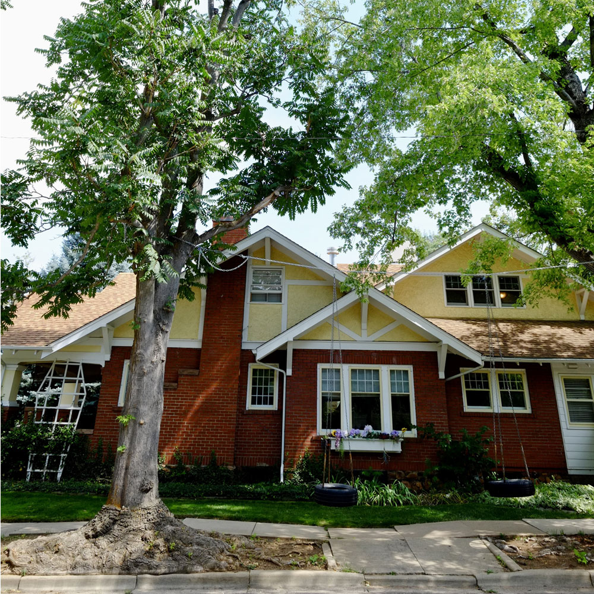
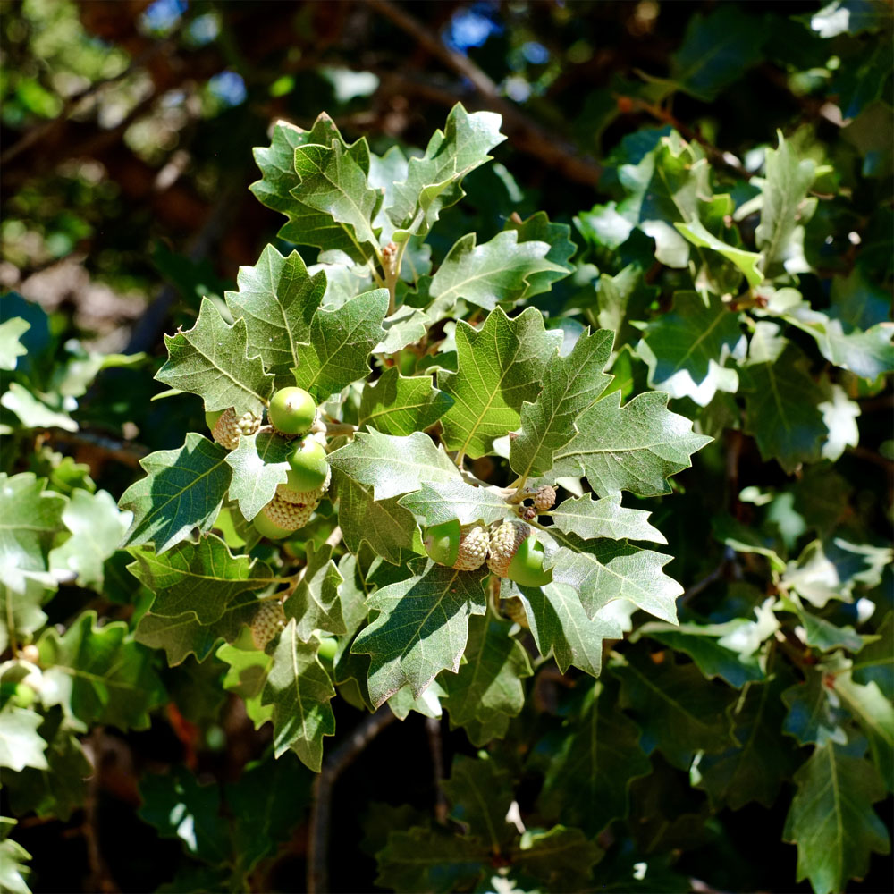
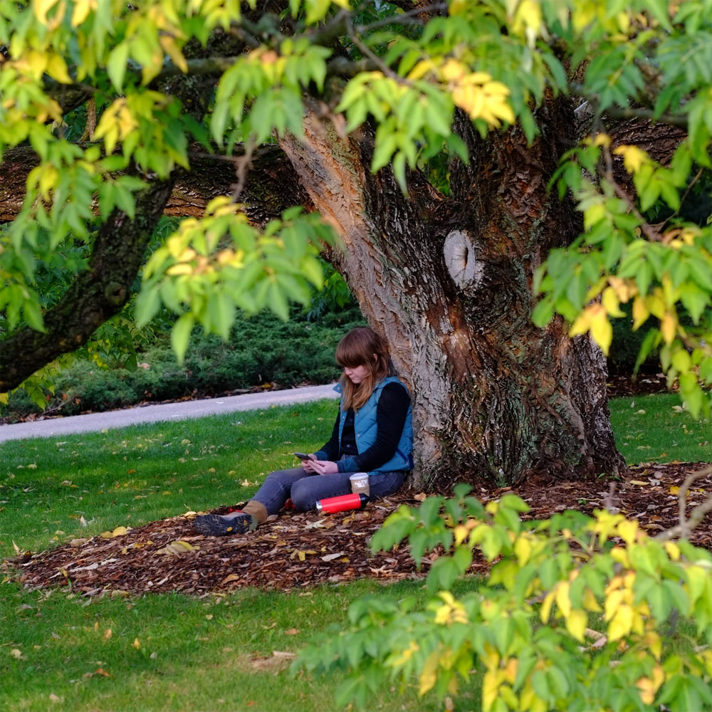

::: {layout-nrow="1" layout-ncol="3"}

:::

## [*A panoramic gathering for urban and community forestry*]{.energy-heading}

Join us for a one-day conference exploring complex and shared
sustainability challenges for urban forests in the Western US from
diverse perspectives. Connect with your colleagues, learn from experts,
and share your insights!

::: {style="text-align: right; font-size: 1.2em"}
[***Save the
date***]{style="color: #CFFC00; background-color: #105456; font-weight: 500;"}\
**Wednesday, May 13, 2026**\
**9:00 a.m. - 4 p.m.**\
**CSU Spur, Denver**
:::

### Event Overview

Throughout history, trees have been used to make life more comfortable
for people living in towns and cities, and we are still discovering all
the ways trees improve people's lives today.

In the Western US, trees and forests do not naturally thrive in most
areas, and the canopy shading most communities instead shows people's
deep and longstanding affinity for trees. But communities in the West
also face unique challenges for growing trees, including limited water
and volatile weather, and many are concerned about the future of urban
forests amid climate shifts and other concerning trends.

At Trees in the West, we explore ways to sustain trees and communities
by learning widely from many different people and sources of knowledge.
Residents, practitioners, policymakers, scientists, and others take part
in conversations about important issues for urban and community forests
in a region with exceptional natural and cultural heritages.

### 2026 Focus: Community Engagement

Each year, we will explore a prominent theme in urban forestry. This
year's sessions will explore community engagement in urban forestry. Regardless of your role,
we hope you will join us to learn and contribute your ideas.

::: {style="text-align: center; padding-top: 1.2em; padding-bottom: 1.2em;"}
#### Continuing education credits available for ISA credential holders

Certified Arborist (5.25), Municipal Specialist (5.25),\
BCMA - Science (2), BCMA - Management (3.25)
:::

### Sponsors

