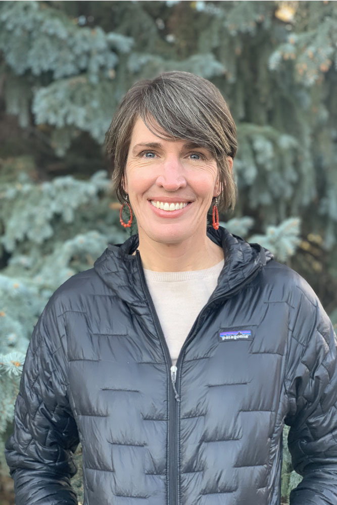

::: {style="float: left; margin-right: 25px; margin-bottom: 25px"}
{fig-alt="Portrait of Lindsay Cutler"
width="200"}
:::

Lindsay has worked at the intersection of plants and people for over 20
years. She holds a BA in Geography and Environmental Studies from UCLA
(2001) and a Masters in Landscape Architecture from the University of
Colorado at Denver (2008). Prior to joining The Park People in 2019, she
worked as a field ecologist on coal mines throughout the American west
and owned and operated a small landscape design/build business focused
on bringing sound ecology to the built environment. Her current work
guiding the strategic direction and urban forestry team at The Park
People is by far the most meaningful, bringing home the powerful role
trees play in building healthy communities.
