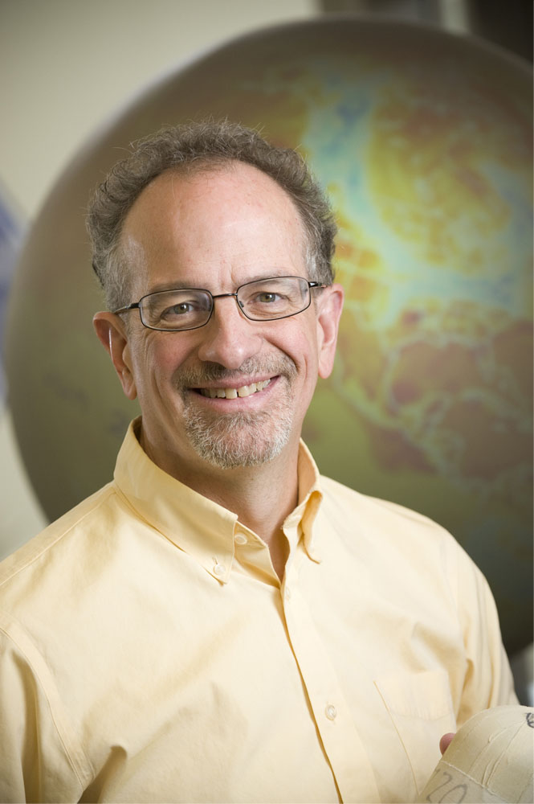

::: {style="float: left; margin-right: 25px; margin-bottom: 25px"}
{fig-alt="Portrait of Dr. Scott Denning" width="200"}
:::

Scott Denning is an Emeritus Professor of Atmospheric Science at CSU and
a Distinguished Visiting Professor at Yale School of the Environment. A
former Editor of the Journal of Climate and Founding Science Chair of
the North American Carbon Program, he led a large research group
studying carbon exchange between ecosystems and the atmosphere at CSU.
On clear moonless weekends he images the cosmos from a mountain cabin in
Wyoming.
