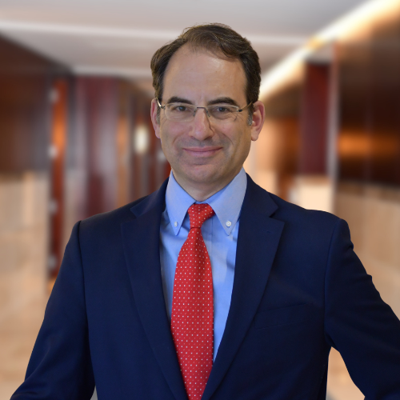

::: {style="float: left; margin-right: 25px; margin-bottom: 25px"}
{fig-alt="Portrait of Phil Weiser"
width="200"}
:::

Phil Weiser is serving his second term as the 39th attorney general of the state of Colorado. Since becoming the state’s chief legal officer in 2019, Attorney General Weiser has demonstrated an unwavering commitment to serving the people of Colorado, advancing the rule of law, protecting our democracy, and promoting justice for all.

Before his time as attorney general, Weiser was the dean of the University of Colorado Law School. He also served as a law clerk to U.S. Supreme Court Justices Byron R. White and Ruth Bader Ginsburg, and held senior positions in the U.S. Department of Justice in the Clinton and Obama administrations. The son and grandson of Holocaust survivors, Weiser is deeply committed to the American Dream and ensuring opportunity for all Coloradans. Weiser lives in Denver with his wife, Dr. Heidi Wald, and their two children.