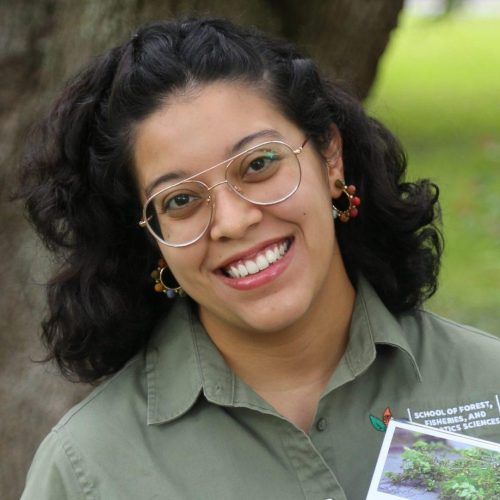

::: {style="float: left; margin-right: 25px; margin-bottom: 25px"}
{fig-alt="Portrait of Stephanie Cadaval"
width="200"}
:::

Stephanie Cadaval is the IFAS Urban Forest Extension Coordinator in the School of Forest, Fisheries, and Geomatic Sciences. She is part of the Urban Forestry Extension Council (UFEC) - an interdisciplinary group engaged in urban forestry, operating from the University of Florida/Institute of Food and Agricultural Sciences (UF/IFAS) Cooperative Extension Service, and established to collaboratively develop new resources and educational messaging for UF/IFAS Extension.
