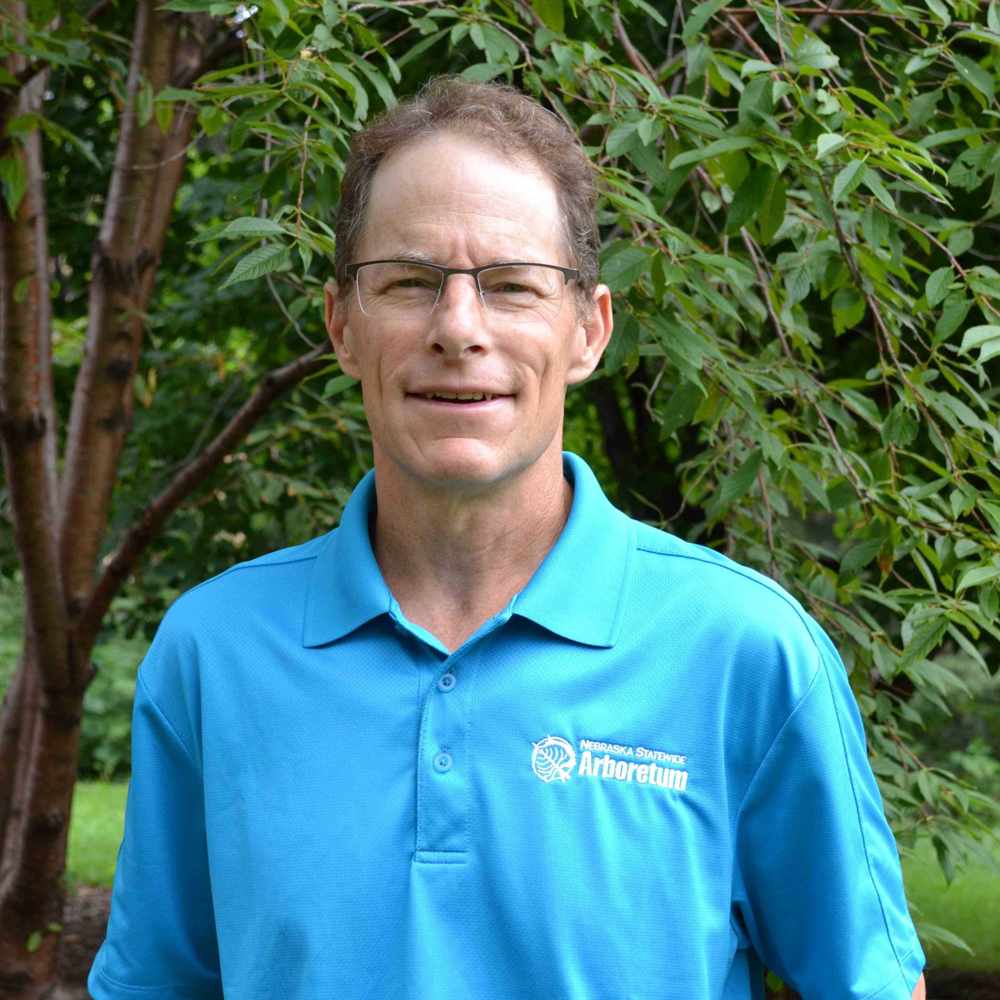

::: {style="float: left; margin-right: 25px; margin-bottom: 25px"}
{fig-alt="Portrait of Justin Evertson"
width="200"}
:::

Justin Evertson has worked for the Nebraska Forest Service (NFS) and Nebraska Statewide Arboretum (NSA) since 1990, serving as the Green Infrastructure Coordinator since 2010. He oversees programs that provide funding, technical assistance and educational outreach for community forestry and public landscaping efforts across the state. Justin is also involved in several tree and shrub trialing efforts to help expand the awareness and availability of underutilized species for the state.  His areas of expertise are in trees, arboriculture and sustainable landscaping. Justin has authored several publications for PlantNebraska with an emphasis on woody plant selection. Justin grew up on a farm in western Kimball County where he learned an appreciation for shortgrass prairie and Nebraska’s wide-open spaces. He’s passionate about trees, the native landscape, biodiversity and sustainability. Justin lives in Waverly where he serves as a volunteer community forester planting trees across the community and working to make the community more biodiverse and sustainable.
