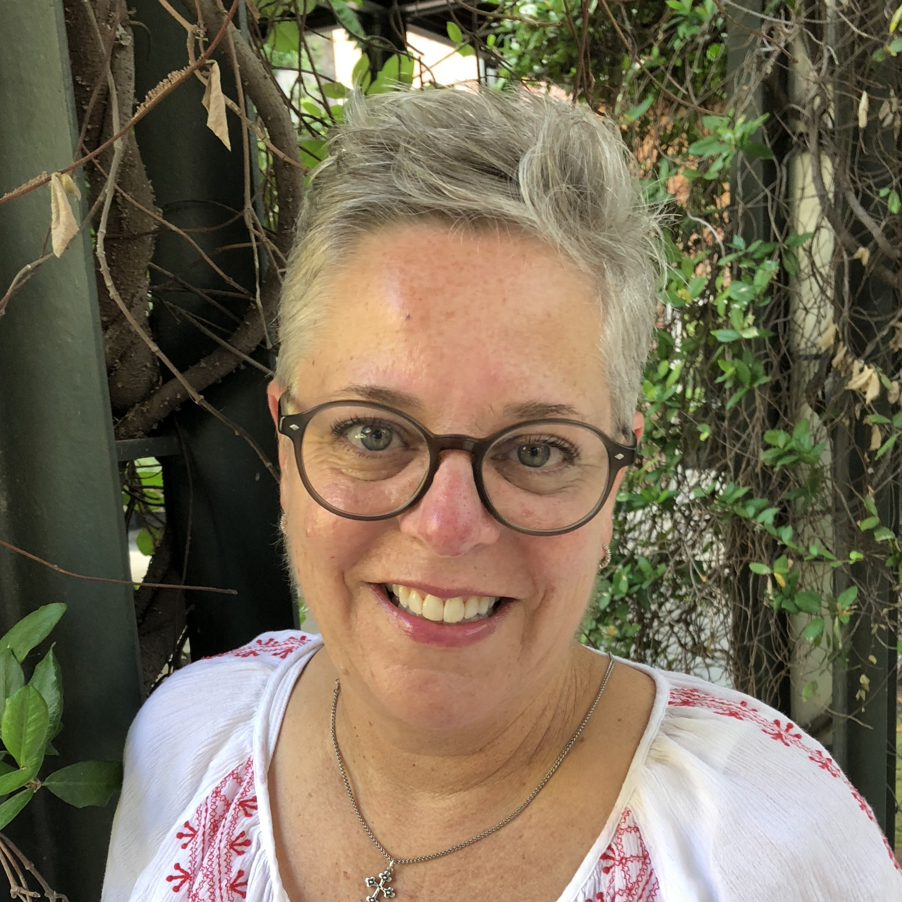

::: {style="float: left; margin-right: 25px; margin-bottom: 25px"}
{fig-alt="Portrait of Dana Karcher"
width="200"}
:::

Dana Karcher is founder and principal consultant for Red Bud Strategies, an urban forestry consulting firm. She recently retired from the Davey Resource Group after having a long career in community forestry that included time at both a local tree nonprofit in California and as the first program director for the Alliance for Community Trees at the Arbor Day Foundation.

During her career, she has assisted communities and other entities throughout the country in developing, planning, and managing their trees through the use of innovative ideas and partnerships with nonprofits, community members, and other municipal departments that touch trees. Her holistic view of urban forestry has led to successful changes in how communities manage their tree assets. She believes in the power of community engagement to help others understand the incredible benefits trees provide to towns and cities.

Dana has seen the results of being engaged in leadership within the arboriculture industry, allowing her to learn from her peers throughout the world. She has served as the President of the International Society of Arboriculture as well as various committees within the industry. She was one of the founders of the Municipal Forestry Institute and the Green Communities Leadership Institute, now serving on the newly developed Green Communities Collaborative. She also is the current President of the Colorado Tree Coalition. She is a frequent speaker at conferences and events where she shares her insight into community forestry. She was awarded the True Professional Award from the ISA in 2024, the Award of Achievement from the Midwest ISA Chapter, and the Award of Commendation from the Western Chapter. Dana lives in Northern Colorado where she hikes, bikes, and does handicrafts.