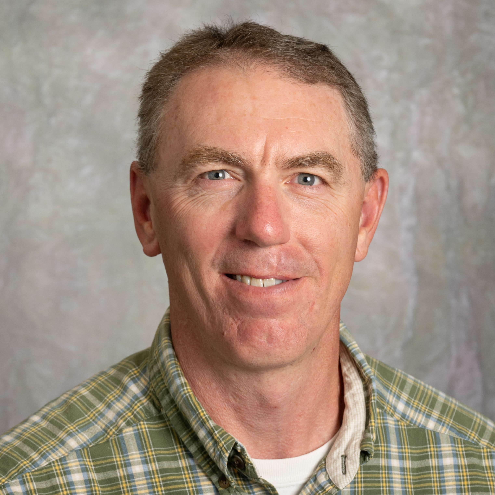

::: {style="float: left; margin-right: 25px; margin-bottom: 25px"}
{fig-alt="Portrait of Adam Moore"
width="200"}
:::

Adam Moore is the Supervisory Forester of Communications and Communities for the Alamosa Field Office of the Colorado State Forest Service where he oversees the daily operations of providing technical forestry services to private landowners, community forests in municipal settings, wildfire preparedness, Good Neighbor Authority efforts with the Rio Grande National Forest and the Bureau of Land Management as well as projects with other partners. Previously, he worked for Virginia State Parks as a Park Ranger, YMCA as an Environmental Educator and the Utah Conservation Corps. Adam is passionate about providing outdoor recreation opportunities for all citizens while also balancing multiple uses of our natural resources at the same time and is actively involved in the Alamosa Tree Board and the San Juan Nordic Club. Outside of work he enjoys biking on roads, gravel and trails, skiing, camping, hiking and miscellaneous projects to reuse old skis.
