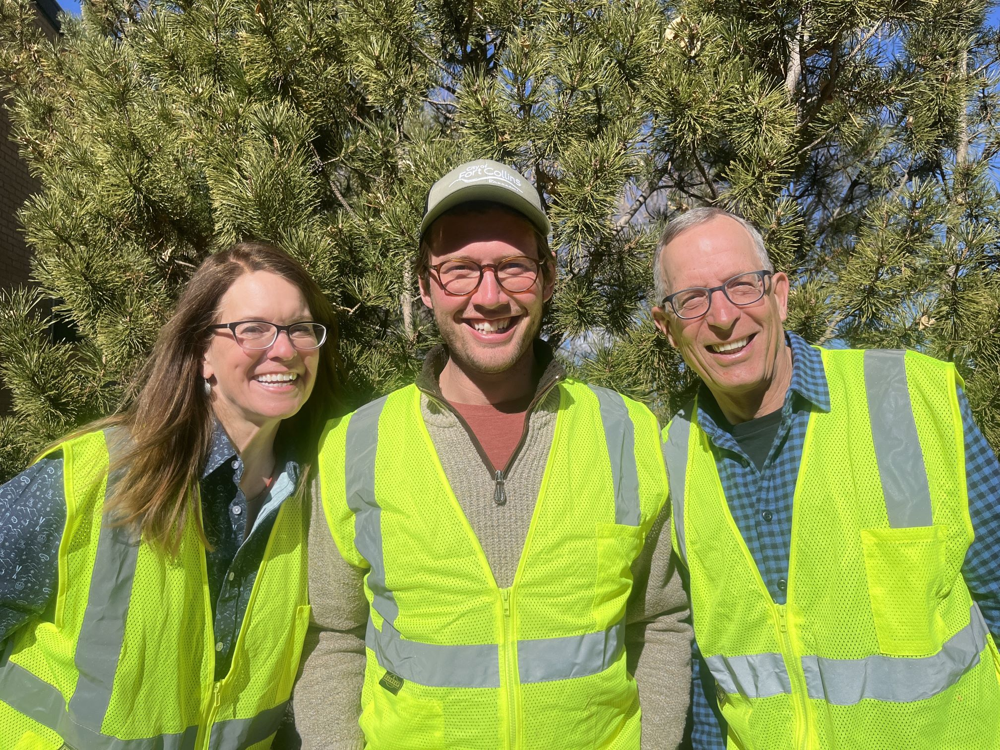

::: {style="float: left; margin-right: 25px; margin-bottom: 25px"}
{fig-alt="Portrait of (left-right) Bev Shaw, Freddie Haberecht, and Eric Larmer"
width="350"}
:::
Bev Shaw (left) is a retired city forester who is thrilled to have combined her love of plants and people to the benefit of the urban forest.\

Freddie Haberecht (middle) is a forester with the City of Fort Collins Forestry Division helping coordinate the Urban Forest Ambassador program.\

Eric Larmer (right) was the first Urban Forest Ambassador volunteer in Fort Collins in 2021. Retired from a career in finance and career coaching, he's had a lifelong love of all things trees.
