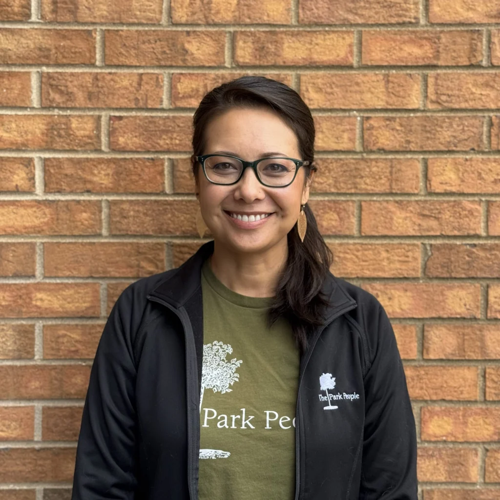

::: {style="float: left; margin-right: 25px; margin-bottom: 25px"}
{fig-alt="Portrait of Kim Yuan-Farrell"
width="200"}
:::

Kim Yuan-Farrell is Executive Director of The Park People, a 57-year-old nonprofit whose mission is working with communities to plant trees and improve parks for a healthy, resilient future. A “Park Person” of 17 years, Kim guides the organization’s vision and activities and builds community partnerships.

Kim has more than 20 years of nonprofit experience, a master’s degree in Environmental Management from Yale University’s School of The Environment, and bachelor’s degrees in Anthropology and Environmental Studies from Santa Clara University. Prior to becoming Executive Director, she directed The Park People’s urban forestry programs, and she has served on key local and national efforts, including the City of Denver’s Park and Rec Advisory Board, Denver’s Urban Forestry Strategic Plan Steering Committee, and the Steering Committee of the Sustainable Urban Forests Coalition.

A Colorado kid raised on the Front Range, Kim lives with her family of four in northwest Denver, not far from where her father grew up after immigrating to Denver from Taiwan as a child. Her mom was raised in Cameroon, Africa, and it’s with a sense of global family that Kim first became concerned about environmental and social issues. Kim is passionate about the power of parks, urban forestry, and community-driven efforts to cultivate resilient, sustainable communities.
